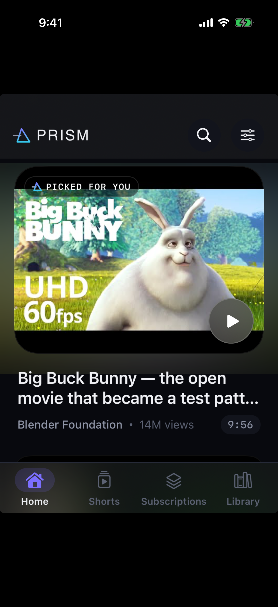
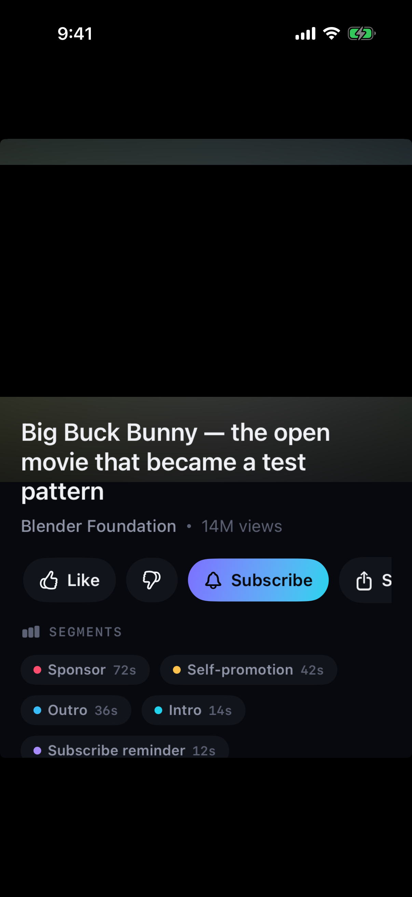
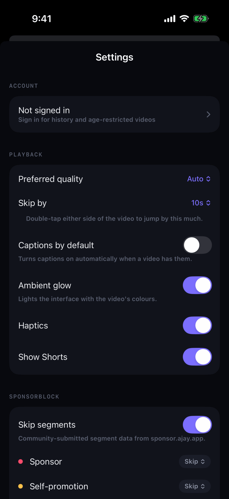

# Prism

A native iOS YouTube client. No ads, SponsorBlock built into the scrubber, no downloads.

Built with SwiftUI and AVFoundation. Personal use.

---

## What it is

Prism plays YouTube without the advertising layer, and shows you the shape of a
video before you commit to it. Its one distinctive idea is the **spectrum
scrubber**: every sponsor, intro and self-promotion in the video is drawn in
place as a band of colour, so you can see what's ahead instead of discovering it
by walking into it.

<p align="center">
  
  
  
</p>

On the scrubber above: the played portion runs violet to cyan, then rose marks a
sponsor, a violet tick a subscribe reminder, amber a self-promotion, and cyan the
outro. The same colours label the segment list below the video, so the setting
and its effect are visibly the same object.

These are real captures from an iOS Simulator running the app in CI, not mockups.

There are deliberately **no downloads**. Streaming is transient; a download is a
copy, and that's the line this project doesn't cross.

## How playback works

The interesting engineering is in getting a playable stream without a server.

YouTube's internal API (`youtubei/v1`) gates most clients behind a **PO Token** —
a proof-of-origin blob produced by an obfuscated JavaScript VM that a native app
can't realistically generate. The well-known "use the iOS client" trick is dead:
tested across a range of videos, it returns `playabilityStatus: OK` with zero
usable format URLs.

Two things make a serverless native client work in 2026:

1. **The visionOS client** still returns a real `hlsManifestUrl` with no PO
   Token, no API key, and no JavaScript signature solving. That manifest carries
   a full H.264 ladder from 144p to 1080p alongside VP9 variants — AVPlayer
   ignores the codecs it can't decode and adapts across the rest by itself. One
   URL buys adaptive bitrate, subtitles, AirPlay and Picture in Picture.

2. **`visitorData` is mandatory.** Without it the API answers `LOGIN_REQUIRED`
   for essentially every video, which looks exactly like an IP ban and is
   usually misdiagnosed as one. Prism mints one token, caches it, and sends it in
   both the request context and the `X-Goog-Visitor-Id` header.

The Android VR client is kept as a fallback and is the only route above 1080p —
it returns adaptive formats including 2160p AV1, at the cost of compositing
separate audio and video tracks. AV1 is only selected on hardware that decodes it
(`VTIsHardwareDecodeSupported`), because a software-decoded 4K stream is a worse
experience than a hardware 1080p one.

```
VISIONOS  → hlsManifestUrl → AVPlayer          ← preferred
ANDROID_VR → adaptive formats → AVMutableComposition  ← fallback, >1080p
```

This is inherently fragile. It depends on clients Google has not yet gated, and
it will break. When it does, the fix is usually a client version bump in
`InnerTubeClientProfile`, not a rewrite.

## iPhone and iPad

One binary, one bundle id, one signature. `TARGETED_DEVICE_FAMILY` is `1,2`, so
the `.ipa` installs on both — an iPad build is not a separate app and doesn't
need separate signing or a second developer account. If your provisioning
profile is a *development* one it pins device UDIDs, so add the iPad's and
re-sign; that costs nothing.

The layout is decided once, in `RootView`, from the size the app actually
occupies — **not** from `userInterfaceIdiom`. That distinction is the whole
design: a Slide Over panel is 320pt wide and reports an iPad idiom the entire
time, and a navigation rail crushed into that column is the classic iPad-port
mistake. Every screen reads `PrismLayout` out of the environment, so a Split
View resize moves all of them together.

| | Phone / narrow | iPad / wide |
|---|---|---|
| Navigation | bottom bar | side rail, which also takes over the wordmark and the search and settings buttons |
| Feed | one column | grid, sized from a target cell width rather than breakpoints |
| Hero | 16:9 | 2.4:1 — 16:9 at 1400pt is 790pt of masthead |
| Watch | up next below the fold | up next in its own column, landscape only |
| Shorts | full width | 9:16, centred, over a blurred backdrop |

Fullscreen rotates its *content* rather than asking the system for an
orientation, because forcing rotation is unreliable across iOS versions and
fights the user's rotation lock. That's right on a phone and wrong on an iPad,
where the window is usually landscape already — so it now rotates only when the
window is portrait.

`LayoutTests` pins the breakpoints at the sizes nobody screenshots: Slide Over,
a Split View half, a 4000pt window.

## SponsorBlock

Segment data comes from [SponsorBlock](https://sponsor.ajay.app). Prism uses the
privacy-preserving endpoint: rather than asking "what's in video X", it sends
only the first four hex characters of `sha256(videoID)` and receives every video
in that bucket, then filters locally. The server never learns what you're
watching.

Sponsors, self-promotion and subscribe reminders skip by default. Intros and
outros are drawn but not skipped — on plenty of channels the intro is the thing
people came for. Every skip is announced with an undo.

## Building

The project is authored on Linux, where Xcode can't run, so **CI is the
compiler**. There is no `.xcodeproj` in the repo — it's generated from
`project.yml` by XcodeGen on the runner.

- **`.github/workflows/build.yml`** produces the `.ipa` artifact — signed when
  the signing secrets are present, unsigned when they aren't.
- **`.github/workflows/screenshots.yml`** boots an iOS Simulator, runs the app
  against bundled fixture data, and captures real PNGs. It does this twice —
  iPhone and iPad — through the same `scripts/capture.sh`, so the two can't
  drift into capturing different screens, which is how an iPad regression stays
  invisible behind green phone shots.

**Signing material never lives in this repo.** It's public, and a certificate
issued to somebody else's team cannot be rotated if its private key leaks.
`.p12`, `.mobileprovision` and `.cer` are gitignored; keep them outside the
working tree.

**Pin the run.** Artifacts keep their name across runs, so `--name` on its own
matches every past copy and downloads them all into one directory, where they
collide. Depending on the `gh` version that surfaces as *"file exists"* or,
confusingly, *"would result in path traversal"* — neither of which is about the
artifact.

```bash
# newest successful build
RID=$(gh run list --workflow=build.yml --status=success --limit 1 \
        --json databaseId --jq '.[0].databaseId')
gh run download "$RID" --name Prism-ipa --dir build

# newest successful screenshot run (also carries the simulator build)
RID=$(gh run list --workflow=screenshots.yml --status=success --limit 1 \
        --json databaseId --jq '.[0].databaseId')
gh run download "$RID" --name Prism-simulator-app --dir simulator
gh run download "$RID" --name screenshots         --dir shots
gh run download "$RID" --name screenshots-ipad    --dir shots-ipad
```

Always pass `--dir` as well; some `gh` versions refuse to extract into the
current directory.

`Prism-simulator-app` contains `Prism.app` for the iOS Simulator. Downloaded
from the web UI it arrives as a zip with the bundle at its root, which is what
[Appetize](https://appetize.io) expects — useful for a look at the interface
from a machine that can't run Xcode. Playback won't be representative there:
YouTube throttles datacenter addresses, and the Simulator is a poor video
decoder regardless.

### Signing

Two routes, both using the same certificate.

`scripts/sign.sh` signs locally, on Linux, with no Xcode and no Mac — it wraps
[zsign](https://github.com/zhlynn/zsign). Run it bare and it pulls the newest
successful CI build:

```bash
./scripts/sign.sh                     # → Prism-signed.ipa
./scripts/sign.sh path/to/Prism.ipa   # or a specific one
```

It expects `~/.prism-signing/*.p12` and `*.mobileprovision` — deliberately
outside the working tree — and checks the profile's App ID against the ipa's
bundle id first, because an explicit App ID signs exactly one bundle id and the
on-device failure for a mismatch tells you nothing about which two things
disagreed.

CI does the same automatically when `IOS_DIST_CERT_P12_BASE64`,
`IOS_DIST_PROFILE_BASE64` and `IOS_CERT_PASSWORD` are set, and emits an
unsigned ipa when they aren't.

Failing both, sign with your own Apple ID via
[Sideloadly](https://sideloadly.io) or [AltStore](https://altstore.io) — a free
account expires after 7 days, a paid one lasts a year.

A development or ad-hoc profile lists device UDIDs, so the build installs only
on the devices it names. That limit is per *device* — not per app, and not per
device family. Adding an iPad is the same exercise as adding a second iPhone.

## Layout

```
Sources/Prism/
  DesignSystem/   palette, type, spacing, motion, ambient glow
  Networking/
    InnerTube/    client, stream selection, feed parsing, visitor session
    SponsorBlock/ segment fetch, overlap resolution
  Player/         engine, spectrum scrubber, controls, video surface
  Features/       home, watch, shorts, search, subscriptions, settings
```

## Signing in

There are two sign-ins, and they are not the same thing — which is why the app
shows them separately instead of behind one button.

| | Mechanism | Unlocks |
|---|---|---|
| **YouTube account** | TV device-code OAuth → `Bearer` | age-restricted videos, watch history, Watch Later, a personal home feed |
| **Google account** | OAuth 2.0 + PKCE | subscription list, liking, subscribing, playlist edits |

### Why not cookies

The obvious approach is to sign in through a web view, keep the Google cookies,
and send a `SAPISIDHASH` header. It does not work here, and the failure is
silent rather than loud.

Tested directly: `VISIONOS` returns **identical anonymous results** whether that
header is correct, deliberately wrong, or absent entirely. It never validates
it. The headset and mobile clients don't support cookie auth at all — only the
WEB-family clients do, and those now require a BotGuard PO token and JavaScript
signature solving, and give up the HLS manifest that makes playback simple.

What InnerTube does accept on that path is `Authorization: Bearer`, and the
tokens have to come from a **first-party YouTube OAuth client**. That is a
per-client restriction on Google's authorization server, not a scope you can
simply ask for:

```
TV client + http://gdata.youtube.com          → code issued
TV client + .../auth/youtube                  → code issued
TV client + .../auth/youtube.readonly         → restricted_client
```

`restricted_client` is Google refusing a scope *for that client*. A Cloud
project you register yourself gets the mirror image: the ordinary YouTube scopes,
never the legacy `gdata` one the playback path wants. Both known first-party
clients (YouTube TV and YouTube VR) are registered as limited-input devices and
reject every redirect URI — custom scheme, loopback and `oob` all return
`Error 400: invalid_request`.

So the device flow isn't a preference, it's the only grant those clients support.
youtubei.js reached the same place: it shipped a custom-OAuth-client example
until June 2025, then deleted it with the note that OAuth2 sign-in only works
with the TV client. SmartTube and Kodi both carry first-party TV credentials
*alongside* a self-registered client, and use the latter only for the Data API —
never for playback.

That keeps `VISIONOS` and its HLS manifest, needs no web view, no cookie jar, no
PO token and no JavaScript — and your password is never typed into this app.
Access is revocable from your Google account page like any other device.

**The risk is still real.** Using any third-party client with your account
breaks YouTube's Terms of Service, and accounts have been flagged for it. The
app says so on the sign-in screen. Use a secondary account if that would cost
you something.

To enable the Google-account half, register an iOS OAuth client (bundle ID
must match `PRODUCT_BUNDLE_IDENTIFIER` in `project.yml`) in Google Cloud
Console and put the ID in `Secrets.swift`.
The consent screen can stay in Testing mode — no verification needed. The
YouTube sign-in works without any of that.

## Status

Working: home feed, search, watch with HLS playback, SponsorBlock skipping,
Shorts, channels with community posts, comments, playlists, library (history,
liked, Watch Later), chapters, quality selection, likes, Picture in Picture,
background audio, both sign-ins. Universal — iPhone and iPad.

A channel's Shorts tab opens the vertical feed at the one you tapped and keeps
scrolling into the rest of that creator's shorts, rather than dropping you into
the ordinary watch screen.

Not built: uploading, live chat, and the AI summary features — the last
deliberately.

Age-restricted videos play once signed in, on an account old enough to watch
them.

**"Made for kids" videos need the optional helper server.** This is a client
capability limit, not an authentication one — established by testing: they
return `UNPLAYABLE` on `VISIONOS`, `ANDROID_VR`, `TVHTML5` and `WEB`, and
generating a real BotGuard PO token doesn't change it. With a valid token the
WEB client resolves titles but still returns zero stream URLs, even for videos
that play fine elsewhere. The blocker is SABR delivery. `server/` handles it —
see below.

## The optional helper server

Everything above works on-device. `server/` exists for the small remainder:
made-for-kids videos, and anything Google moves to SABR-only delivery where
formats carry no URL at all.

It wraps yt-dlp in about a hundred lines of Node. The app calls it **only after
direct extraction has already failed**, so with no server configured nothing
changes — it's a safety net, not a dependency, and it doubles as insurance for
whenever Google gates another client.

```bash
cd server && node server.js     # needs yt-dlp and Node on the machine
```

Then put its address into Settings → Helper server and press Test connection.
Verified end to end: Baby Shark resolves at 1080p H.264 + AAC, both URLs serving
`HTTP 206`, with cached lookups returning in ~10ms.

## A note on formats

YouTube is migrating its API from `*Renderer` objects to view-models, and the
migration is uneven. Two surfaces have already moved, and both were verified
against live responses rather than documentation:

- **Comments** return zero `commentRenderer`s. Ordering lives in
  `commentViewModel` entries; the data lives in
  `frameworkUpdates.entityBatchUpdate` mutations, joined by `commentKey`.
- **Playlists** return zero `playlistVideoRenderer`s and 100 `lockupViewModel`s.
- **Shorts** are `shortsLockupViewModel`, which shares almost nothing with
  `videoRenderer`: the id is in `entityId` or the tap endpoint, and the title
  sits under `overlayMetadata` keyed on `content` rather than `text`. Continuations
  have to carry the tab through for the same reason — a shorts page parsed as
  videos comes back empty and reads as a channel that ran out of shorts.

A parser written from the documented shape returns an empty list rather than
erroring — it looks like "no comments" instead of "broken parser". The parsers
here handle both formats and harvest renderers by key at any depth, so a moved
path doesn't break them.

## Licence and intent

This is a personal project for personal use. It isn't affiliated with YouTube or
Google, it can't go on the App Store, and using it is against YouTube's Terms of
Service. Build it for yourself; don't distribute builds.
